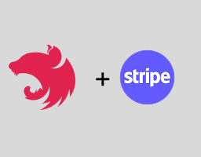

  

### Descrição do Projeto

Este projeto tem como objetivo o estudo da integração com o Stripe, Node.js com o framework Nestjs. Este projeto é uma aplicação relativamente simples, criada com foco no estudo da integração com o Stripe, sem preocupação com retornos complexos ou tratamento avançado de erros. A API permite criar usuários, que podem realizar assinaturas diretamente no Stripe. A aplicação utiliza docker-compose para subir um container com PostgreSQL, e o Prisma como ORM. Além disso, a aplicação está configurada para escutar webhooks do Stripe e processar os eventos recebidos.

---

### Tecnologias utilizadas no projeto

- NodeJs
- NestJS
- Prisma
- Docker e docker-compose
- PostgreSQL
- Typescript
- Entre outros

---

### Arquitetura

A arquitetura do projeto segue a seguinte estrutura estrutura:

<pre style="overflow-x: auto; max-width: 1000px; white-space: pre;">
src/
│── app/
│   ├── app.module.ts                       # Arquivo principal do NestJS, onde os módulos da aplicação são configurados
│
│── modules/
│   ├── stripe/
│   │   ├── infra/                          # Implementações concretas para Stripe (ex: repositórios, integração)
│   │   ├── services/                       # Serviços relacionados a pagamentos/assinaturas
│   │   ├── stripe.module.ts                # Módulo do Stripe, integrando serviços e providers
│   │
│   ├── user/
│   │   ├── domain/                         # Entidades e regras de negócio do usuário
│   │   ├── dto/                            # Objetos de transferência de dados (entrada/saída)
│   │   ├── infra/                           # Implementações concretas (ex: repositórios)
│   │   ├── port/                            # Interfaces (contratos) para a camada de usuário
│   │   ├── services/                        # Serviços de aplicação relacionados a usuário
│   │   ├── user.module.ts                   # Módulo de usuário
│
│── shared/                                  # Recursos compartilhados entre módulos
│       ├── prisma/
│           ├── prisma.ts                            # Configuração e instância do Prisma (ORM)
│
│── utils/
│   ├── stripe.ts                            # Utilitários e helpers para Stripe
│
│── main.ts                                  # Ponto de entrada da aplicação NestJS
</pre>

---

### Como rodar o projeto em sua máquina:

### Requisitos:

- Node na versão _22.15.0_
- Typescript na _5.7.3_.
- Conta criada no Stripe para ter os acessos das keys que são necessárias.

### Passo a passo:

- Primeiramente, clone o projeto com o comando git clone https://github.com/CaioSousaa/stripe-webhook.git
- Rode o comando `npm i` para instalar as dependências do projeto.
- Crie um arquivo `.env `e preencha os valores usando as variáveis definidas no arquivo `.env.example`
- Após isso, rode o comando `docker-compose up -d` para rodar o container Docker com o banco de dados respectivo
- Após o banco de dados subir, rode os comandos `npx prisma generate` para gerar a pasta `generated` de onde vem o Prisma Client e `npx prisma migrate dev` para subir as migrations
- Depois, rode o comando `npm run dev` para rodar a aplicação.

### Material que utilizei para esse estudo

- https://medium.com/@Sasindu50/simplify-payments-a-guide-to-integrating-stripe-with-node-js-98307dea0daf
- https://medium.com/@kisora.thomas/using-stripe-api-and-webhooks-in-your-nest-app-98ba999a8d8c
- https://youtu.be/W7x3zsm8NoM?si=nYgpTHgBqAVXnbIk

Caso tenha algua duvida sobre o projeto mande um e-mail para 2004caio.rocha@gmail.com.
